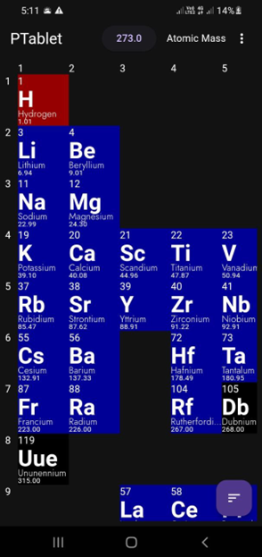

# Ptablet

An periodic table app made in flutter.

)

## Getting Started

**Prerequisites**

* You need to have Flutter installed on your machine. You can follow the instructions on the Flutter website: https://flutter.dev/docs/get-started/install to install Flutter.
* You also need to have a code editor installed. Visual Studio Code is a popular choice, but you can use any code editor that you like.
* git installed

**Clone the repository**

The first step is to clone the repository from GitHub. You can do this using the following command in your terminal / commandline:

```
git clone https://github.com/AvikArefin/Ptablet.git
```

This will create a directory called `Ptablet` in your current working directory.

**Open the project in your code editor**

Once you have cloned the repository, you can open the project in your code editor.

**Run the project**

To run the project, you can use the following command:

```
flutter run
```

This will launch options in your terminal (if you do not have android / windows setup it will directly run on your default browser. See disclaimer).

**To contribute to the periodictable project**

If you would like to contribute to the periodictable project, you can fork the repository on GitHub and submit a pull request. Please make sure that your changes are well-documented and that they pass all of the unit tests.

**Disclaimer**

This project was only tested in Windows and Android. It may not work as expected on other platforms.

**Thank you for your interest in the periodictable project!**
